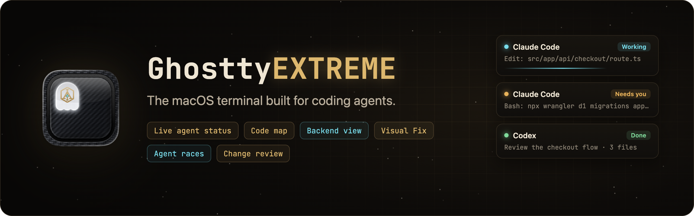
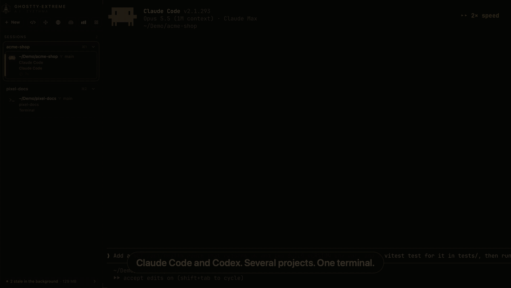

<p align="center">
  
</p>

<p align="center">
  <a href="https://github.com/steventsvik/GhosttyEXTREME/releases/latest"></a>
  
  
  <a href="LICENSE"></a>
  <a href="https://ghostty.org"></a>
</p>

**GhosttyEXTREME is a macOS terminal for developers who run several AI coding agents
(Claude Code, Codex) across several projects at once.** It's a fork of
[Ghostty](https://ghostty.org) that shows what every agent is doing, lets them share
what they've learned, and keeps the dev servers, ports and branches they leave behind in
view.

> [!NOTE]
> Unofficial fork. Not affiliated with or endorsed by the Ghostty project. Everything
> Ghostty does still works, and your Ghostty config works as-is.

<!-- DEMO GIF: replace images/readme/demo.gif with the 60–90 s demo cut (see the shot list). -->
<p align="center">
  
</p>

```sh
curl -fsSL https://raw.githubusercontent.com/steventsvik/GhosttyEXTREME/custom/install.sh | bash
```

<sub>Apple silicon, macOS 13 or newer. Free and open source (AGPL-3.0). No account, no telemetry.</sub>

## The 30-second tour

1. **Open a tab per project and start an agent** the way you already do: `claude` or
   `codex`. The sidebar groups tabs by repository and gives each agent a live card: its
   task, what it's doing right now, and how long it's been at it.
2. **Run several at once.** When one needs permission, its card turns amber with
   **Allow** and **Deny**. Answer from the sidebar, Mission Control (⌃⌘M) or the
   notification without leaving what you're doing.
3. **Watch the code being written.** The editor (⌃⌘E) opens each file the agent reads and
   types in its edits as they happen.
4. **Pass work between agents.** Hand Off sends Codex what Claude Code did (the task, the
   diff, failed commands), and both agents start each session knowing what the other has
   learned about the project.
5. **Undo a turn you don't like.** Every turn starts with a snapshot, so one click puts
   your files back.

## Features

### Manage agents across projects

- **Agent sidebar.** Every tab with its folder, git branch, uncommitted changes and agent.
  Claude Code and Codex report live status through hooks: working, waiting for
  permission, waiting for input, done or failed. Gemini CLI, Copilot, Cursor, Amp,
  opencode, Goose, Droid and Hermes are recognized by their logos.
- **Project groups.** Tabs in the same repository are grouped with a summary
  ("2 working · 1 waiting"), and you're warned when two agents edit the same file.
- **Allow / Deny from anywhere.** Answer permission prompts from the sidebar card, Mission
  Control or the notification. Keys are sent only when the agent's prompt is actually on
  screen.
- **Mission Control** (⌃⌘M). Every agent in every window as a live card, with agents
  waiting on you first. The command palette (⌘P) puts them first too.
- **Hand off** (tab's ⋮ menu, Mission Control or ⌘P). Pass a pane's work to a new or running Claude Code or Codex. The message
  carries the task, the recent conversation, exactly what changed and failed commands, and
  you can edit it first. You can ask the second agent to continue, review, or give a
  second opinion.
- **Review loops.** Pair a writer with a reviewer. The reviewer answers APPROVED or CHANGES
  NEEDED, and its findings go back to the writer until it approves or hits the round
  limit. Each message waits for you to press Send unless you turn on automatic sending.
- **Agent races** (⌃⌘R). Give one task to several agents, each in its own git worktree,
  compare the diffs and keep the best one.
- **Undo an agent's turn.** Every turn is snapshotted as git objects (no commits, branches
  or stash entries). Restore lists every file it will change and asks first.
- **Review inbox** (⌃⌘I). Each agent's finished diff, with line comments you can send back
  as its next prompt.

### Shared memory

- **Project Memory** (⌃⌘Y). What Claude Code and Codex remember about the current
  project, in one window. Edit or delete Claude Code's notes and your `CLAUDE.md` /
  `AGENTS.md` files. Codex's memories are shown read-only, because Codex rewrites them
  itself.
- **Shared between agents.** A new Codex session starts with Claude Code's notes for the
  project, and a new Claude Code session starts with Codex's, labeled as possibly out of
  date. Hand Off and Review Loop include them when sending to an agent that's already
  running.
- Everything stays on your Mac. You can turn it off in Settings.

### Isolation and Docker

- **Isolated sessions.** **+ New → Isolated Session (Docker)** opens Ubuntu 24.04,
  Python 3.13, Node 22, or a sandboxed Claude Code or Codex in a throwaway container. Only
  the tab's folder is mounted, at `/workspace`; your home folder is not. The container is
  deleted when you exit. Sandboxed agents keep their own login in a Docker volume; your
  Mac's credentials are never shared. Needs Docker Desktop, OrbStack or Colima; if Docker
  isn't running and Colima is installed, it starts Colima and stops it again afterwards.
- **Races run in separate git worktrees**, so racing agents can't touch each other's
  work or yours.

### Watch agents live

- **Code editor that follows the agent** (⌃⌘E). A Monaco editor per tab that opens what
  the agent reads and animates its edits in, plus a timeline of prompts, thinking and tool
  calls, sub-agents included.
- **Code map.** Your project as a map, with files lit as the agent reads and edits them,
  and each file's blast radius: what imports it, with a warning when no test covers the
  change.
- **Backend view.** What your project runs on (Cloudflare Workers and their bindings,
  Supabase, Vercel, Prisma, Firebase, Stripe and more), worked out from its own files.
  Live deploy status comes from the providers' own CLIs, using read-only commands. The
  piece of backend the agent is editing lights up.
- **Database view.** Tables, columns and relations from your migrations or Prisma schema,
  with Postgres tables that lack row-level security flagged.
- **Agent activity** (⌃⌘A). Time, prompts, changes, tokens, and what your usage would cost
  at API prices, per day, agent and project.

### Dev tools

- **Localhost sessions** (⌃⌘L). When an agent starts a dev server, SSH tunnel,
  `kubectl port-forward`, `ngrok` or `make dev`, it opens in its own tab and keeps running
  after the agent is done. The agent is told the URL.
- **Ports.** What's listening, which project it belongs to, and a Stop button. When a
  command fails with "address already in use", the sidebar says what holds the port.
- **Git panel.** Click a tab's branch to see its pull request with every check (failing
  ones first), branches, stashes and recent commits. Tabs show ↑↓ commit counts and the
  PR's check status. PR data needs the GitHub CLI (`gh`).
- **Visual Fix** (⌃⌘V). Preview your dev server, click an element and say what to change.
  The agent gets the element, its source file and a screenshot.
- **Background** (⌃⌘K). Leftover dev servers, containers, VMs and agent sessions, rated by
  how stale they are, with cleanup that always asks first.
- **Command history** (⌃⌘B). Every command as a block. A failed one can go straight to an
  agent.

### Setup and updates

- **One-line install** that checks the release's SHA-256 checksum.
- **Welcome window and Check Setup.** They connect Claude Code and Codex in one click,
  backing up each file first, and diagnose problems with a fix button for each.
  `ghostty-extreme doctor` runs the same checks in a terminal.
- **Signed updates in the app.** The app accepts only updates signed by this project.
- **Settings** (⌘,). Turn any feature off; a feature that's off does no background work.

## How it compares

GhosttyEXTREME is for watching and steering the CLI agents you already use. If you want a
terminal or editor with its own built-in AI, Warp or Zed may suit you better.

| | GhosttyEXTREME | [Ghostty](https://ghostty.org) | [cmux](https://github.com/manaflow-ai/cmux) | [Warp](https://www.warp.dev) | [Zed](https://zed.dev) |
|---|---|---|---|---|---|
| **What it is** | Ghostty fork for running coding agents | Fast native terminal | Ghostty-based terminal for agents | Terminal with built-in agents | Code editor with an agent panel |
| **Runs Claude Code, Codex & co. unchanged** | ✓ | ✓ | ✓ | ✓ | ✓ in its terminal; also via ACP |
| **Status of every agent at a glance** | Sidebar card per agent | — | Pane rings, tab highlights, sidebar notification text | Tab status and notifications (Claude Code, Codex, OpenCode via plugins) | For agents in its panel |
| **Answer a permission prompt without switching** | Sidebar, Mission Control or notification | — | — | Notifies you; answering elsewhere not documented | For agents in its panel |
| **See the code as the agent writes it** | Editor follows the CLI agent live | — | — | Code review panel for the agent's diff | Follows agents in its panel |
| **Undo an agent's turn** | ✓ | — | — | Not documented for CLI agents | Checkpoints in its agent panel |
| **Backend view** (Cloudflare, Supabase, Vercel) | ✓ | — | — | — | — |
| **Open source** | AGPL-3.0 | MIT | Client GPL-3.0; server BSL | Client AGPL/MIT; AI and cloud proprietary | GPL-3.0 |
| **Platforms** | macOS (Apple silicon) | macOS, Linux | macOS | macOS, Linux, Windows | macOS, Linux, Windows |

**Where others are ahead:** Warp and Zed run on Linux and Windows and come with their own
AI. cmux has SSH workspaces and a browser your agents can control, and its sidebar also
shows PR status and listening ports. Ghostty is the lean
original that all of this is built on. GhosttyEXTREME is macOS-only, Apple silicon only,
not notarized by Apple, and maintained by one person.

<sub>Compared from each project's public docs on October 7, 2026. Corrections welcome.</sub>

## Install

```sh
curl -fsSL https://raw.githubusercontent.com/steventsvik/GhosttyEXTREME/custom/install.sh | bash
```

This downloads the [latest release](https://github.com/steventsvik/GhosttyEXTREME/releases/latest),
checks its SHA-256 checksum and puts **GhosttyEXTREME.app** in `/Applications`. On first
launch, the welcome window connects Claude Code and Codex and runs a live test.

<details>
<summary>Installing by hand instead</summary>

<br>

Download `GhosttyEXTREME-<version>-macos-arm64.zip` from the
[latest release](https://github.com/steventsvik/GhosttyEXTREME/releases/latest), unzip it and
move **GhosttyEXTREME.app** to `/Applications`. The app isn't notarized by Apple, so clear the
download quarantine once:

```sh
xattr -dr com.apple.quarantine /Applications/GhosttyEXTREME.app
```

</details>

## Keyboard shortcuts

Hold ⌃⌘ for a moment to see them all over the window.

| Shortcut | |
|---|---|
| ⌘P | Command palette: agents waiting on you, new sessions, every tool |
| ⌘, | Settings (Ghostty's config file is under GhosttyEXTREME → Edit Config File…) |
| ⌃⌘S | Show or hide the sidebar |
| ⌃⌘M | Mission Control |
| ⌃⌘E | Code editor |
| ⌃⌘Y | Project memory |
| ⌃⌘L | Localhost sessions |
| ⌃⌘V | Visual Fix |
| ⌃⌘I | Review changes |
| ⌃⌘R | Race agents |
| ⌃⌘K | Background |
| ⌃⌘B | Command history |
| ⌃⌘A | Agent activity |
| ⌃⌘/ | Every shortcut |

## Security and privacy

- **Nothing leaves your Mac.** There's no account, telemetry or server. Agent tracking
  and shared memory read the files Claude Code and Codex already write.
- **Only your own hooks can talk to it.** Agent status arrives as terminal escape
  sequences, which any printed text could imitate, so each launch creates a secret that
  only its own terminals and hooks know. Events without it are ignored.
- **The Backend view never stores credentials.** It runs the providers' own CLIs with
  their existing logins, using read-only commands, and reads only the *names* of env
  variables.
- **Light on your Mac.** Animations run in Core Animation and pause when they're off
  screen. With six agents working, the maintainer measured about 1–3% CPU.

## Agent status setup

<details>
<summary><b>Connect Claude Code, Codex and your shell by hand</b></summary>

<br>

The welcome window and **Check Setup** do all of this for you. The steps below are what
they do.

GhosttyEXTREME sets `GHOSTTY_EXTREME_AGENT_EVENTS=1` in its terminals. The hook
scripts in `agent-hooks/` do nothing anywhere else.

```sh
./agent-hooks/install.sh
```

This copies the hooks to `~/.ghostty-extreme/agent-hooks/` and the `localhost` command
to `~/.ghostty-extreme/bin/`. Point your agents there rather than at the repo: macOS
privacy protection can block terminal processes from reading `~/Desktop` or
`~/Documents`, which silently breaks the hooks.

**Shell detection.** Add this to `~/.zshrc`:

```sh
[[ -n "$GHOSTTY_EXTREME_AGENT_EVENTS" ]] && source ~/.ghostty-extreme/agent-hooks/ghostty-extreme.zsh
```

**Claude Code.** In `~/.claude/settings.json`, run
`~/.ghostty-extreme/agent-hooks/agent-hook.sh claude <event>` for these hooks:

| Hook | Event |
|---|---|
| `SessionStart` | `session_start` |
| `UserPromptSubmit` | `prompt_submit` |
| `PostToolUse` | `tool_complete` |
| `PermissionRequest` | `permission_request` |
| `Notification` | `notification` |
| `Stop` | `stop` |
| `StopFailure` | `stop_failure` |
| `SessionEnd` | `session_end` |
| `PreToolUse` (matcher `Bash`) | `pre_tool_use` (moves dev servers into localhost sessions) |

```json
{ "type": "command", "command": "~/.ghostty-extreme/agent-hooks/agent-hook.sh claude stop" }
```

**Codex.** Run `python3 agent-hooks/install-codex.py`. It registers Codex's hooks without
touching Claude's settings or saved hook approvals, and backs up the config first.
Restart Codex and approve the new registrations through its normal hook review.

**Claude usage meter** (optional). Have your Claude Code status line script save
`rate_limits` to `~/.claude/ghostty-extreme/claude-usage.json` as
`{"updated": <unix time>, "rate_limits": <rate_limits>}`.

</details>

## Build from source

<details>
<summary><b>Requirements and build steps</b></summary>

<br>

- macOS 13 or newer (developed and tested on macOS 26, Apple silicon)
- Xcode 26 or newer
- Zig 0.15 from Homebrew: `brew install zig@0.15` (the ziglang.org build fails to link
  against the macOS 26.4+ SDKs)
- `jq` for the agent hooks: `brew install jq`

```sh
git clone https://github.com/steventsvik/GhosttyEXTREME.git
cd GhosttyEXTREME
/opt/homebrew/opt/zig@0.15/bin/zig build -Doptimize=ReleaseFast -Dxcframework-target=native
ditto macos/build/ReleaseLocal/Ghostty.app /Applications/GhosttyEXTREME.app
```

If the repo is in an iCloud-synced folder (like Desktop or Documents), codesign fails on
iCloud's extended attributes. Point `macos/build` at a folder outside iCloud first;
`update-ghostty.sh` does this for you.

`./update-ghostty.sh` rebases this fork onto the newest official Ghostty release, rebuilds
and installs it (it needs an `upstream` remote pointing at `ghostty-org/ghostty`).
`--check` only reports whether a new release exists.

</details>

## License

AGPL-3.0, see [LICENSE](LICENSE). Ghostty's own code is MIT
([LICENSE-GHOSTTY](LICENSE-GHOSTTY)). Parts of the sidebar are derived from
[Warp](https://github.com/warpdotdev/warp) (AGPL-3.0). Full credits and trademark notes
are in [NOTICE.md](NOTICE.md).

For Ghostty itself (configuration, themes, keybindings), see the
[Ghostty documentation](https://ghostty.org/docs).
