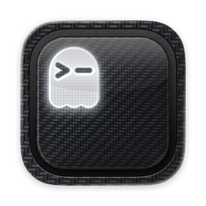

<h1 align="center">
  <br>
  GhosttyEXTREME
</h1>

<p align="center">
  <a href="https://ghostty.org">Ghostty</a> for macOS, rebuilt for working with coding agents.<br>
  Vertical tabs, live agent status, a built-in code editor and multi-agent tools.
</p>

> Unofficial fork. Not affiliated with or endorsed by the Ghostty project.
> Everything Ghostty does still works: this fork tracks official Ghostty
> releases and adds features on top.

## Features

**Vertical tabs sidebar** (⌃⌘S)
- Warp-style tab list with folder, git branch, pinning, colored tabs and a hover card.
- Detects the coding agent running in each pane (Claude Code, Codex, Gemini CLI,
  Copilot, Cursor, Amp, opencode, Goose, Droid, Hermes) and shows its logo.
- Live status badges: working, waiting for permission, waiting for input, done, failed.
- Plan usage gauges for Claude and ChatGPT at the bottom of the sidebar.

**Code editor** (⌃⌘E)
- A VS Code–style panel (Monaco) per tab that follows the terminal's folder and theme.
- Agent panel and follow mode: watch the agent read files and see its edits
  animate in, with sub-agents in a split view.

**Agent tools**
- **Command palette** (⌘P): agents waiting on you come first, plus new sessions and view toggles.
- **Mission Control** (⌃⌘M): every agent in every window at a glance.
- **Agent races** (⌃⌘R): run the same task with several agents in separate git
  worktrees, compare the diffs and keep the best one.
- **Handoff**: pass a pane's context to a fresh Claude Code session in a split.
- **Alerts**: a notification and Dock badge when an agent needs you.

**Localhost sessions** (⌃⌘L)
- When Claude Code starts a dev server (`npm run dev`, `vite`, `rails s`, `python -m
  http.server`, ...), it opens in its own tab instead, so it keeps running after the
  agent is done. The agent is told the URL and how to read the logs.
- Each server gets a card in the sidebar: live status, `localhost:PORT` to click,
  framework badge, uptime, restart and stop.
- The Localhost manager groups every server by project, shows CPU and memory, previews
  pages in a built-in browser, and finds dev servers running elsewhere on your Mac, with
  "Keep alive" to move one into its own tab.
- Start one yourself from **New → Localhost Server…** (it offers the folder's
  `package.json` scripts).

**Review changes** (⌃⌘I)
- When an agent finishes working in a git repo, its changes land in a review inbox.
- Read the diff file by file, comment on lines and send the comments back to the agent
  as its next prompt, approve or undo files, commit, or open a pull request.

**Command history** (⌃⌘B)
- Every command you run becomes a block with its output, exit code and duration.
- A failed command pops up a chip with **Fix with Claude** / **Fix with Codex**, which
  opens the agent in a split with the command and its output.

**Agent activity** (⌃⌘A)
- Active time, prompts, files and lines changed, commands, test runs and tokens, per
  day, per agent and per project, read from Claude Code's and Codex's session history.
- Resume any recent session in a new tab.

**Sessions**
- New Terminal, Claude Code, Codex, Hermes or Claude Code cloud sessions from the sidebar.
- Isolated Docker sessions (Ubuntu, Python, Node) and sandboxed Claude Code / Codex.

## Requirements

- macOS 13 or newer (developed and tested on macOS 26, Apple silicon)
- Xcode 26 or newer
- Zig 0.15 from Homebrew: `brew install zig@0.15` (the ziglang.org build fails
  to link against the macOS 26.4+ SDKs)
- `jq` for the agent hooks: `brew install jq`

## Build

```sh
git clone https://github.com/steventsvik/GhosttyEXTREME.git
cd GhosttyEXTREME
/opt/homebrew/opt/zig@0.15/bin/zig build -Doptimize=ReleaseFast -Dxcframework-target=native
ditto macos/build/ReleaseLocal/Ghostty.app /Applications/GhosttyEXTREME.app
```

If the repo is in an iCloud-synced folder (like Desktop or Documents), codesign
fails on iCloud's extended attributes. Point `macos/build` at a folder outside
iCloud first; `update-ghostty.sh` does this for you.

## Agent status setup

GhosttyEXTREME sets `GHOSTTY_EXTREME_AGENT_EVENTS=1` in its terminals. The hook
scripts in `agent-hooks/` do nothing anywhere else.

First install them outside the repo:

```sh
./agent-hooks/install.sh
```

This copies the hooks to `~/.ghostty-extreme/agent-hooks/` and the `localhost` command
to `~/.ghostty-extreme/bin/`. Point your agents there rather than at the repo: macOS
privacy protection can block terminal processes from reading `~/Desktop` or
`~/Documents`, which silently breaks the hooks. Rerun it after pulling changes.

**Shell detection** (shows the agent's logo as soon as you start it). Add to `~/.zshrc`:

```sh
[[ -n "$GHOSTTY_EXTREME_AGENT_EVENTS" ]] && source ~/.ghostty-extreme/agent-hooks/ghostty-extreme.zsh
```

**Claude Code status.** In `~/.claude/settings.json`, run
`~/.ghostty-extreme/agent-hooks/agent-hook.sh claude <event>` for these hooks:

| Hook | Event |
|---|---|
| `SessionStart` | `session_start` |
| `UserPromptSubmit` | `prompt_submit` |
| `PostToolUse` | `tool_complete` |
| `PermissionRequest` | `permission_request` |
| `Notification` | `notification` |
| `Stop` | `stop` |
| `StopFailure` | `stop_failure` |
| `SessionEnd` | `session_end` |
| `PreToolUse` (matcher `Bash`) | `pre_tool_use` (moves dev servers into localhost sessions) |

```json
{ "type": "command", "command": "~/.ghostty-extreme/agent-hooks/agent-hook.sh claude stop" }
```

**Codex status.** Same script with `codex` as the first argument, in
`~/.codex/hooks.json`. Codex asks you to approve the hooks once.

**Claude usage gauge** (optional). Have your Claude Code status line script save
`rate_limits` to `~/.claude/ghostty-extreme/claude-usage.json` as
`{"updated": <unix time>, "rate_limits": <rate_limits>}`.

## Staying up to date

`./update-ghostty.sh` rebases this fork onto the newest official Ghostty
release, rebuilds and installs it. `./update-ghostty.sh --check` only reports
whether a new release exists. It needs an `upstream` remote pointing at
`ghostty-org/ghostty`.

## License

AGPL-3.0, see [LICENSE](LICENSE). Ghostty's own code is MIT
([LICENSE-GHOSTTY](LICENSE-GHOSTTY)). Parts of the sidebar are derived from
[Warp](https://github.com/warpdotdev/warp) (AGPL-3.0). Full credits and
trademark notes are in [NOTICE.md](NOTICE.md).

For Ghostty itself (configuration, themes, keybindings), see the
[Ghostty documentation](https://ghostty.org/docs).
