<p align="center">
  
</p>

<p align="center">
  <a href="https://github.com/steventsvik/GhosttyEXTREME/releases/latest"></a>
  
  
  <a href="LICENSE"></a>
  <a href="https://ghostty.org"></a>
</p>

<p align="center">
  <b><a href="https://github.com/steventsvik/GhosttyEXTREME/releases/latest">Download</a></b> ·
  <a href="#watch-your-agents-work-live">Live agents</a> ·
  <a href="#features">Features</a> ·
  <a href="#how-it-compares">Compare</a> ·
  <a href="#install">Install</a> ·
  <a href="#keyboard-shortcuts">Shortcuts</a> ·
  <a href="#security-and-privacy">Security</a>
</p>

<p align="center">
  
</p>

<p align="center"><sub>Real app, real agents, demo projects.</sub></p>

**GhosttyEXTREME is a macOS terminal for developers who run several AI coding agents,
like Claude Code and Codex, across several projects at once.** It's a fork of
[Ghostty](https://ghostty.org), the fast native terminal, that shows what every agent is
doing, live: the code it's writing as it writes it, where it is in your project, what part
of your backend it touches, and when it needs you. Agents share what they learn about each
project, hand work to each other, and leave their changes in a review inbox you can undo
from.

Everything Ghostty does still works, and your Ghostty config works as-is. This fork tracks
official Ghostty releases and adds its features on top.

> [!NOTE]
> Unofficial fork. Not affiliated with or endorsed by the Ghostty project.

```sh
curl -fsSL https://raw.githubusercontent.com/steventsvik/GhosttyEXTREME/custom/install.sh | bash
```

<sub>Apple silicon, macOS 13 or newer. Free and open source (AGPL-3.0). No account, no telemetry.</sub>

<br>

## Watch your agents work, live

Run Claude Code, Codex, Gemini CLI or another agent in a tab, the way you already do.
GhosttyEXTREME follows each one as it works.

<p align="center">
  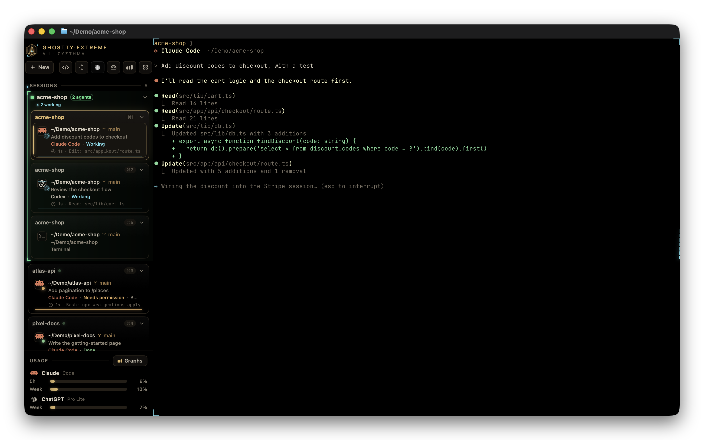
</p>

| As the agent… | …you see |
|---|---|
| **starts a task** | Its card in the sidebar shows the task, a working spinner and a timer, and the corners of its terminal breathe. A snapshot of your project is saved, so the turn can be undone. |
| **reads a file** | The editor opens that file at the lines it read, and the file lights up cyan on the code map. |
| **edits a file** | The change types itself into the editor with the lines highlighted, the file turns orange on the map, and the turn's diff count goes up. |
| **thinks or replies** | The agent panel shows its thinking, messages and every tool call as a timeline, sub-agents included. |
| **touches your backend** | The Worker, database or bucket that code belongs to lights up in the Backend view. |
| **starts a dev server** | The server moves into its own tab and keeps running after the agent is done. |
| **needs you** | Its card turns amber with **Allow** and **Deny** buttons and jumps to the top of the command palette and Mission Control. You get a notification you can answer from, and a Dock badge. |
| **finishes** | Its changes land in Review with the full diff. Not what you wanted? **Undo last turn** puts your files back. |

Claude Code and Codex report live status through hooks that the welcome window sets up in
one click. Gemini CLI, Copilot, Cursor, Amp, opencode, Goose, Droid and Hermes are
recognized by their logos.

<br>

## Features

<table>
<tr>
<td width="33%" valign="top"><b><a href="#every-agent-at-a-glance">Agent sidebar</a></b><br><sub>Live status for every agent in every tab</sub></td>
<td width="33%" valign="top"><b><a href="#mission-control">Mission Control</a></b><br><sub>Every agent in every window on one screen</sub></td>
<td width="33%" valign="top"><b><a href="#a-code-editor-that-follows-the-agent">Code editor</a></b><br><sub>Opens what the agent reads and animates its edits</sub></td>
</tr>
<tr>
<td valign="top"><b><a href="#code-map">Code map</a></b><br><sub>Your project as a map of what the agent touched</sub></td>
<td valign="top"><b><a href="#project-memory">Project memory</a></b><br><sub>What Claude Code and Codex know, shared between them</sub></td>
<td valign="top"><b><a href="#hand-off">Hand off</a></b><br><sub>Pass a pane's work to Claude or Codex, with the diff</sub></td>
</tr>
<tr>
<td valign="top"><b><a href="#review-changes">Review changes</a></b><br><sub>An inbox for each agent's diff, with line comments</sub></td>
<td valign="top"><b><a href="#undo-an-agents-turn">Undo a turn</a></b><br><sub>A snapshot before every turn, restored in one click</sub></td>
<td valign="top"><b><a href="#review-loops">Review loops</a></b><br><sub>One agent reviews another, round after round</sub></td>
</tr>
<tr>
<td valign="top"><b><a href="#see-your-backend">Backend view</a></b><br><sub>Cloudflare, Supabase, Vercel and more, with live status</sub></td>
<td valign="top"><b><a href="#database">Database view</a></b><br><sub>Tables, columns and relations from your schema</sub></td>
<td valign="top"><b><a href="#visual-fix">Visual Fix</a></b><br><sub>Click an element in your app, say what to change</sub></td>
</tr>
<tr>
<td valign="top"><b><a href="#localhost-sessions">Localhost sessions</a></b><br><sub>Dev servers that outlive the agent that started them</sub></td>
<td valign="top"><b><a href="#ports">Ports</a></b><br><sub>What's listening, and who holds a busy port</sub></td>
<td valign="top"><b><a href="#git-panel">Git panel</a></b><br><sub>Pull request, checks, branches, stashes, commits</sub></td>
</tr>
<tr>
<td valign="top"><b><a href="#isolated-sessions">Isolated sessions</a></b><br><sub>Throwaway Docker containers with only your project</sub></td>
<td valign="top"><b><a href="#agent-races">Agent races</a></b><br><sub>Several agents, one task, keep the best result</sub></td>
<td valign="top"><b><a href="#background-processes">Background processes</a></b><br><sub>Find and close what's been left running</sub></td>
</tr>
<tr>
<td valign="top"><b><a href="#command-history">Command history</a></b><br><sub>Every command as a block, with one-click fixes</sub></td>
<td valign="top"><b><a href="#agent-activity">Agent activity</a></b><br><sub>Time, prompts, changes and tokens per day and project</sub></td>
<td valign="top"><b><a href="#setup-settings-and-updates">Setup and settings</a></b><br><sub>One-click setup, Check Setup, signed updates</sub></td>
</tr>
</table>

<br>

### Every agent, at a glance

<p align="center">
  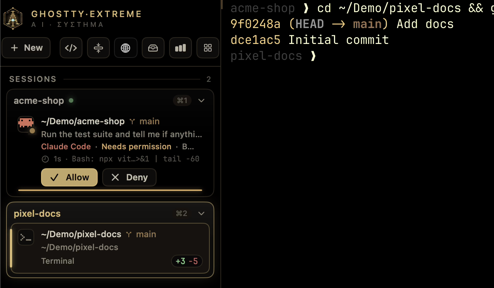
</p>

A vertical sidebar (⌃⌘S) lists every tab with its folder, git branch and uncommitted
changes. Tabs can be pinned, colored and renamed, and hovering one shows a card with more
detail.

- **Live status:** working, waiting for permission, waiting for input, done or failed. Each
  card shows the task, how long the agent has been at it and its last action.
- **Answer without switching:** **Allow** and **Deny** right on the card, in Mission Control
  and in the notification. Keys are only sent when the agent's prompt is actually on screen.
- **Project groups:** tabs whose agents share a repository are grouped together, with a live
  summary ("2 working · 1 waiting") and a warning when two agents edit the same file.
- **Agents act out their mood.** Their sprite reads, types, runs commands and thinks, hops
  when it needs you and sparkles when it's done. The sigil glows amber while one waits and
  flares gold when one finishes.
- **Alerts:** when an agent waits on you in a pane you aren't looking at, you get a
  notification (click it to jump there) and a count on the Dock icon.
- **Usage meters** for your Claude and ChatGPT plans (5-hour and weekly windows), with
  graphs.

### Mission Control

<p align="center">
  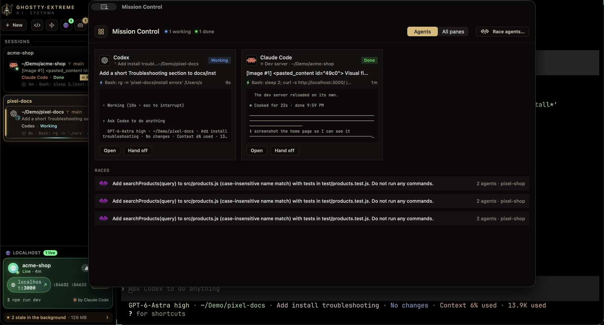
</p>

⌃⌘M shows every agent (or every pane) in every window as a live card: status, task, last
action, time in that state and the last lines of its terminal. Agents waiting on you come
first. Click a card to jump to it, or hand its work off from there.

The **command palette** (⌘P) puts waiting agents at the top too, so you can answer one in
two keystrokes. It also starts new sessions and opens every tool.

<br>

### A code editor that follows the agent

Each tab has its own VS Code–style editor (Monaco, ⌃⌘E) on that tab's folder, in your
terminal theme.

- **Follow mode:** the editor opens each file the agent reads and animates its edits in as
  they happen. It follows even while closed, so opening it mid-task shows where the agent
  is right away.
- **Agent panel:** a timeline of the session: prompts, thinking, messages, tool calls and
  results, sub-agents included. With several sub-agents, the editor splits into a pane for
  each.
- **AI POV:** replay a session as if you were at the agent's keyboard: files opening, code
  being typed, commands running.

#### Code map

<p align="center">
  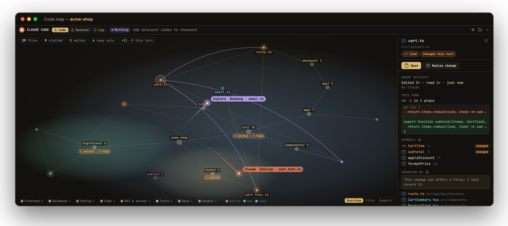
</p>

Your project as a star map. Folders are tinted by what they are: frontend, API, database,
tests, config. Files light up as the agent reads (cyan) and edits (orange) them.

- **Zoom levels:** **Overview** shows the project's areas and how much the agent did in
  each. **Files** shows every file. **Symbols** shows the functions and classes inside, with
  the ones changed this turn lit.
- **Details for anything you click:** what the agent did there, this turn's diff, the
  file's symbols, what imports it, and the backend pieces it uses.
- **Blast radius:** what imports the file is drawn on the map, with a warning when no
  test covers the change.

<br>

### Project memory

<p align="center">
  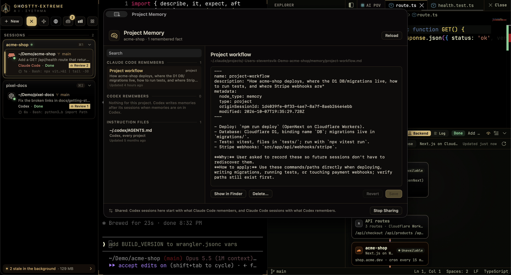
</p>

⌃⌘Y shows what Claude Code and Codex remember about the current project, in one window.

- **Claude Code's notes** can be read, edited and deleted. Deleting one removes it from
  `MEMORY.md` too.
- **Codex's memories** for the project are shown read-only, because Codex rewrites them
  itself.
- **Instruction files** (`CLAUDE.md`, `CLAUDE.local.md`, `AGENTS.md`) that the agents load
  every session can be edited in place. It never overwrites a file an agent changed while
  you were editing.

#### Shared between agents

<p align="center">
  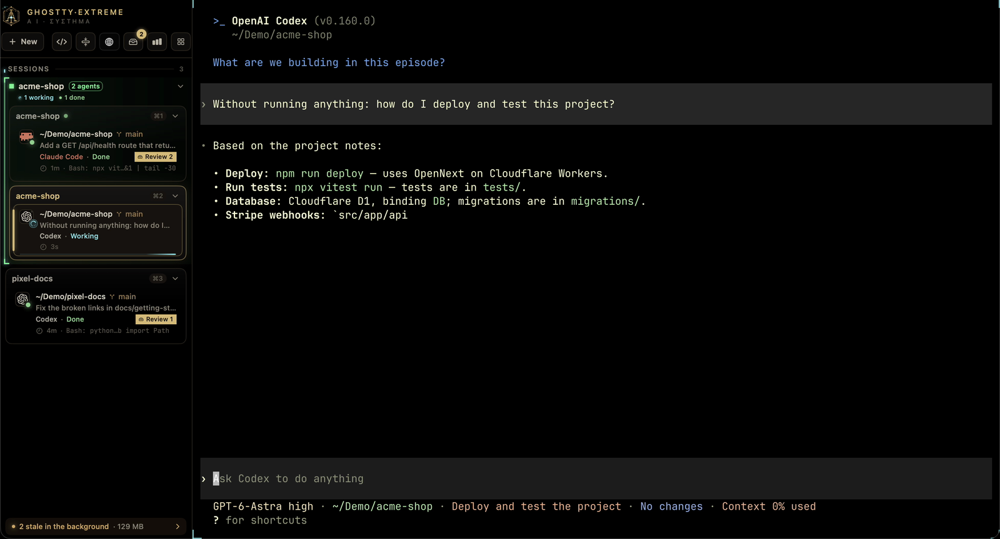
</p>

A new Codex session starts with what Claude Code has learned about the project, and a new
Claude Code session with what Codex has learned, labelled as notes that may be out of date.
Above, a fresh Codex session answers "how do I deploy and test this project?" from Claude's
notes without opening a file. Nothing leaves your Mac, and you can turn it off in Settings.

<br>

### Hand off

<p align="center">
  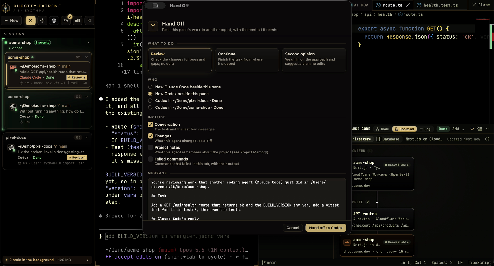
</p>

Pass a pane's work to another Claude Code or Codex session: a new one in a split beside it,
or one that's already running.

- **What it carries:** the task, the recent conversation, exactly what the first agent
  changed (a diff since its first prompt), failed commands, and what the first agent
  remembers about the project. You can read and edit the message first.
- **What to do:** **Continue** picks up where the last agent stopped, **Review** checks the
  work without editing anything, and **Second opinion** weighs in on the approach.
- **Failed commands** can go straight to the agent already working on the project.

### Review loops

Pair an agent with a reviewer (⋮ → Start a review loop…). Each time the writer finishes a
turn, the reviewer gets its changes and answers APPROVED or CHANGES NEEDED, and its
findings go back to the writer, until it approves or a round limit. Every message waits for
your Send unless you turn on Send automatically, and nothing is ever typed into an agent
mid-turn or over your own typing.

### Review changes

<p align="center">
  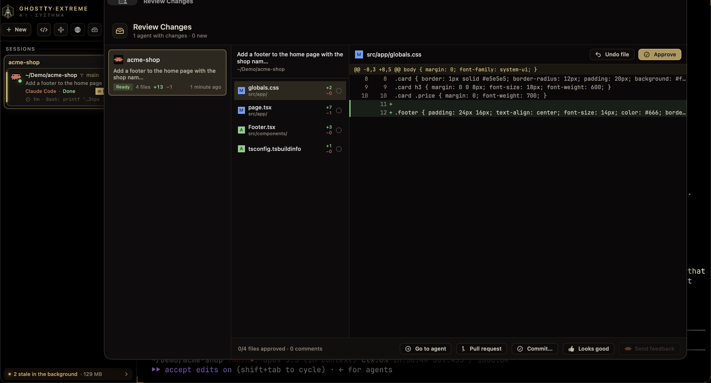
</p>

When an agent finishes working in a git repository, its changes land in an inbox (⌃⌘I).

- **Read the diff** file by file, and approve or undo each file.
- **Comment on lines** and send the comments back as the agent's next prompt.
- **Finish up:** commit, or open a pull request.

### Undo an agent's turn

<p align="center">
  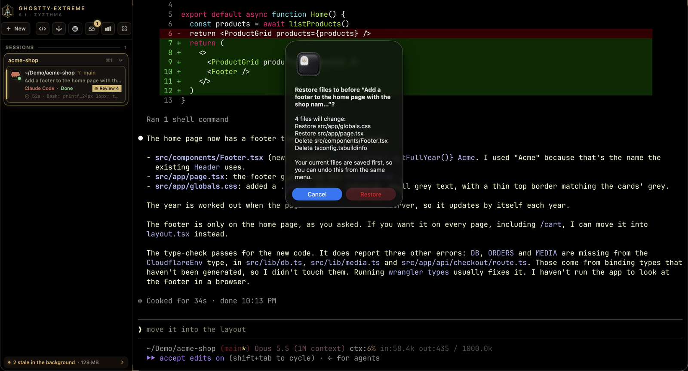
</p>

Every agent turn starts with a snapshot of your project. **Undo last turn** (or an earlier
one) from the tab's ⋮ menu, or **Restore to before this** on any of your prompts in the
agent timeline. It lists every file it will change and asks first, and your current files
are saved too, so the undo can be undone, and the review inbox updates to match. Snapshots are git objects only: no commits,
branches or stash entries, and your staged changes stay as they are. Folders that aren't
repositories work too.

<br>

### See your backend

<p align="center">
  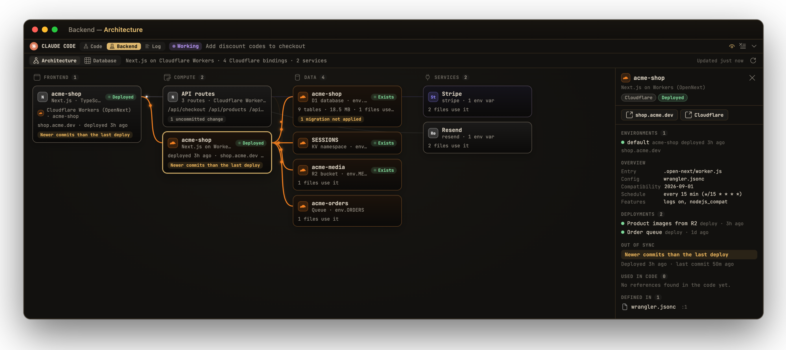
</p>

The **Backend** tab in the code editor's agent panel shows what your project runs on,
worked out from its own files (`package.json`, `wrangler.jsonc`, `supabase/`, `.vercel/`,
Prisma, env variable names). It works offline and without logins.

- **Architecture:** frontend → compute → data → services, with a line only where your
  code really connects two pieces.
  - **Cloudflare Workers** show their environments, domains, cron schedules and every
    binding: D1, Hyperdrive, KV, R2, Queues, Durable Objects, service bindings, Workers AI
    and more.
  - **Supabase, Vercel, Prisma, Firebase,** and services like Stripe, OpenAI and Resend,
    show up too.
- **Live status** comes from each provider's own CLI (`wrangler`, `supabase`, `vercel`),
  using the logins you already have and only read-only commands. It shows deploys per
  environment, project health, migrations not applied yet, and commits newer than the
  last deploy.
- **Code links:** click any piece to see every file that uses it, and open the provider's
  dashboard or your live site.
- **Agent awareness:** when the agent edits something that belongs to a piece of your
  backend, that piece lights up.

#### Database

<p align="center">
  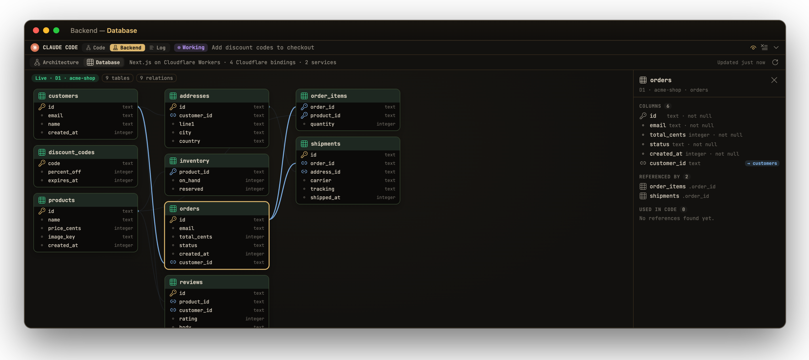
</p>

The **Database** view draws your schema: tables, columns and relations for Supabase,
Cloudflare D1, Postgres behind Hyperdrive (read from your migrations) and Prisma.

- **Click a table** to see its columns, what references it and where your code queries it.
- **Row-level security** is checked on every Postgres table.
- **Large schemas** can be searched, and unrelated tables fade back.

<br>

### Visual Fix

<p align="center">
  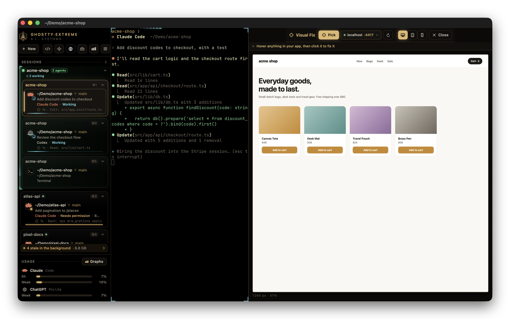
</p>

⌃⌘V previews your running dev server beside the terminal, at desktop, tablet or phone size.

- **Pick an element:** hover any element and click it, then say what should change.
- **What the agent gets:** the element's HTML and CSS selector, the component and source
  file that render it (React, Vue and Svelte), its computed styles, and a screenshot.
- **Where it goes:** the request goes to the agent working in that project, pinned to the
  element, and its card shows "Visual fix:" with what you asked for. When the change lands,
  the preview reloads where you were.

<p align="center">
  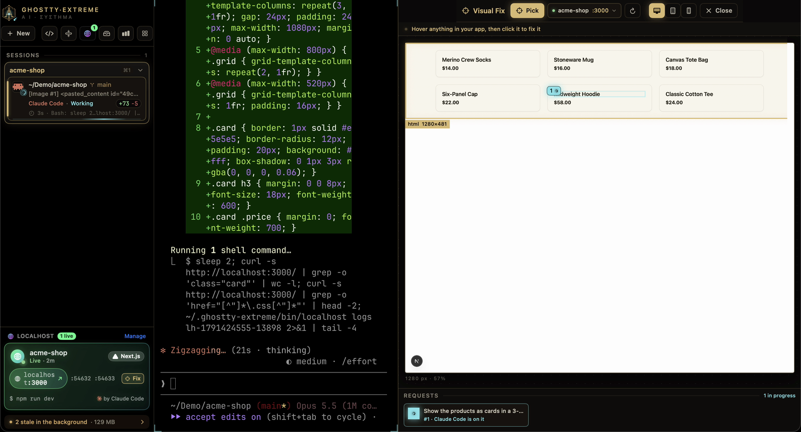
</p>

<br>

### Localhost sessions

<p align="center">
  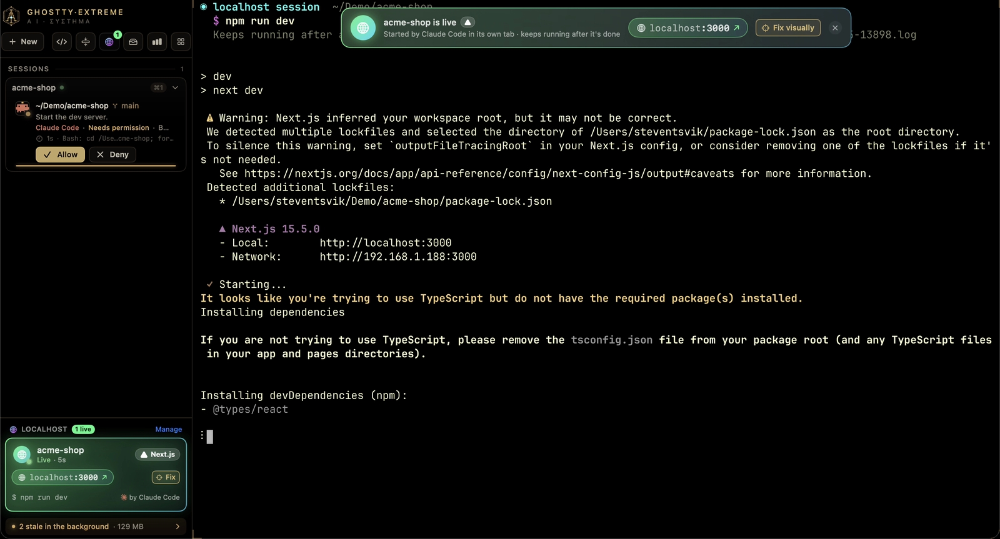
</p>

When an agent starts a dev server (`npm run dev`, `vite`, `rails s`, `make dev`, …), an
SSH tunnel, `kubectl port-forward`, `ngrok` or `cloudflared`, it opens in its own tab
instead, so it keeps running after the agent is done. The agent is told the URL and how to
read the logs.

- **Sidebar cards:** each server gets a card with live status, its `localhost` URL,
  framework, uptime, restart and stop.
- **The Localhost manager** (⌃⌘L) groups servers by project and shows their CPU and memory.
  It previews pages in a built-in browser and finds dev servers running elsewhere on your
  Mac, with **Keep alive** to move one into its own tab.
- **Start one yourself** from **New → Localhost Server…**, which offers your
  `package.json` scripts.

### Ports

The sidebar lists what's listening, which project it belongs to (Next.js, Vite, Django and
more get their own badge) and what started it. Open it in the browser or Visual Fix, jump
to its tab, or stop it. When a command fails because its port is taken ("EADDRINUSE",
"address already in use"), the sidebar names what holds the port and offers to stop it.

### Git panel

<p align="center">
  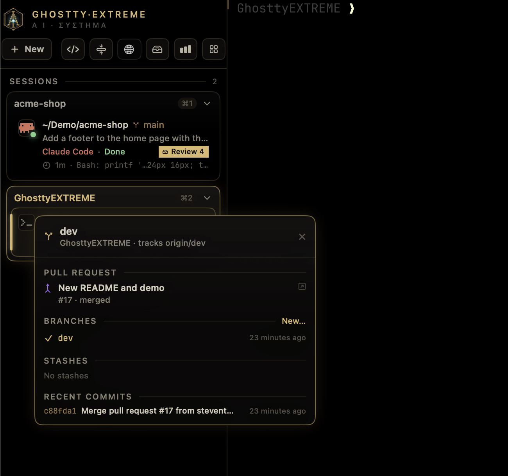
</p>

Click a tab's branch for a panel with its pull request (title, review state and every
check, failing ones first, each linked to its log), branches (switch, filter, create),
stashes (stash, apply, pop, drop) and recent commits. Tabs show commits to push and pull
(↑2 ↓1) and the pull request's number and checks beside the branch. Pull requests come
from the GitHub CLI (`gh`) when it's installed and signed in.

<br>

### Isolated sessions

<p align="center">
  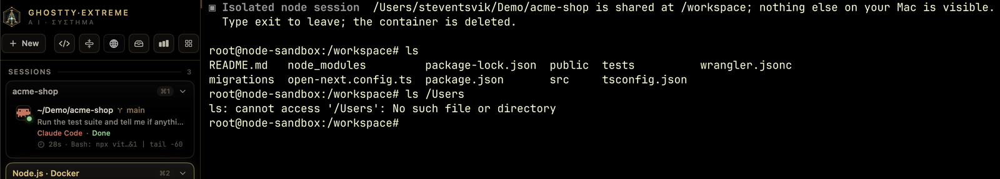
</p>

**+ New → Isolated Session (Docker)** opens Ubuntu 24.04, Python 3.13, Node 22, or a
sandboxed Claude Code or Codex in a throwaway container. Only the tab's folder is mounted,
at `/workspace`; your home folder is not, and the container is deleted when you exit.
Sandboxed agents keep their own login in a Docker volume, so your Mac's credentials are
never shared. Needs Docker Desktop, OrbStack or Colima; if Docker isn't running and Colima
is installed, it starts Colima and stops it again afterwards.

### Agent races

⌃⌘R gives the same task to several agents at once (Claude Code and Codex, or several of
one), each in its own git worktree so they can't touch each other's work or yours. Compare
their diffs side by side and apply the one you want.

### Background processes

<p align="center">
  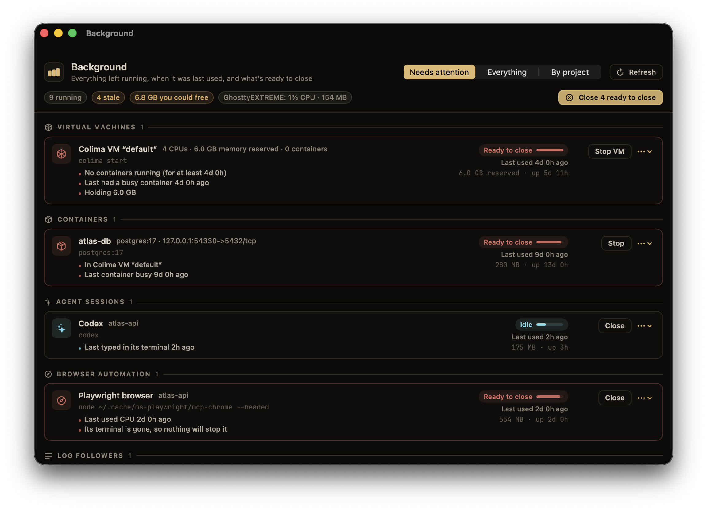
</p>

⌃⌘K finds everything left running: dev servers, Colima VMs and containers, agent sessions,
browser automation, databases, watchers, log followers and login services.

- **Last really used:** the last typing or output in its terminal, its agent transcript
  being written, a live connection to its port, or a busy container.
- **A staleness rating** (Active, Idle, Stale or Ready to close), with the reasons.
- **Cleanup in one click,** always with a confirmation first. Login services are never
  marked ready to close.

### Command history

Every command becomes a block with its output, exit code and duration (⌃⌘B). When one
fails, a chip offers **Fix with Claude** or **Fix with Codex**, or sends it to the agent
already working on the project, with the command and its output.

### Agent activity

⌃⌘A shows active time, prompts, files and lines changed, commands, test runs and tokens,
per day, hour, agent and project. It reads the session history Claude Code and Codex
already keep. **Resume** any recent session in a new tab, and **API value** shows what your
usage would cost at API prices.

### Setup, settings and updates

<p align="center">
  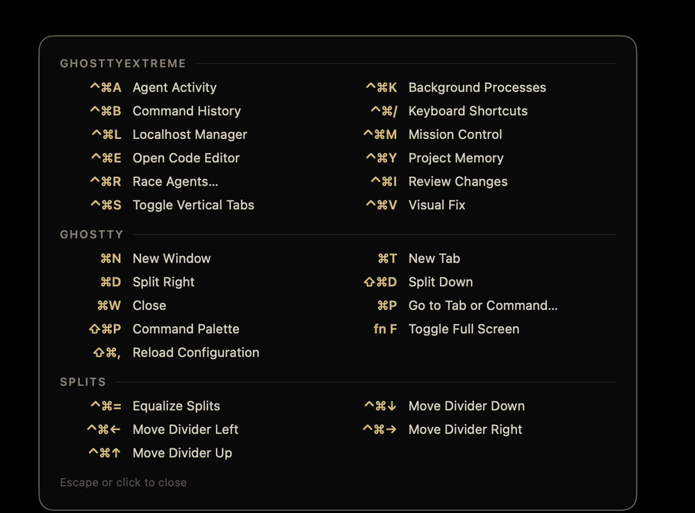
</p>

- **Welcome window:** on first launch it finds Claude Code, Codex and the tools the hooks
  need, connects your agents in one click (backing up each file it changes), lets you pick
  features, and runs a live test.
- **Check Setup** (GhosttyEXTREME menu or ⌘P) checks the hooks, each agent's config, jq,
  the shell integration and notifications, with a fix button on each problem.
  `ghostty-extreme doctor` runs the same checks in a terminal.
- **Settings** (⌘,) turns each feature on or off. A feature that's off has no menu item,
  shortcut, button or palette entry, and does no background work.
- **Every shortcut:** hold ⌃⌘ for a moment to see them all over the window.
- **Updates** arrive in the app (GhosttyEXTREME → Check for Updates…), signed with this
  project's key; nothing else is accepted.

### Everything Ghostty already does

GPU-accelerated rendering, native tabs and splits, the quick terminal, hundreds of themes,
ligatures, shell integration, AppleScript and Shortcuts. Your Ghostty config works as-is.

<br>

## Light on your Mac

All of the sidebar's animations run in Core Animation, so the app does almost no work per
frame. Anything you can't see pauses: background tabs, hidden and minimized windows. With
six agents working at once, GhosttyEXTREME uses about **1–3% CPU** (measured on an
Apple silicon MacBook).

## Security and privacy

- **Nothing leaves your Mac.** There's no account, telemetry or server. Agent tracking and
  shared memory read the files Claude Code and Codex already write.
- **Only your own hooks can talk to it.** Agent status arrives as terminal escape
  sequences, which any printed text could imitate. Each launch creates a secret that only
  its own terminals and hooks know, and events without it are ignored.
- **The Backend view never stores credentials.** It runs your providers' own CLIs with
  their existing logins, read-only commands only. It reads only the *names* of your env
  variables, never their values.
- **The editor stays local.** It can only show its own pages, and Visual Fix only talks
  to your local dev server.

<br>

## How it compares

GhosttyEXTREME is for watching and steering the CLI agents you already use. If you want a
terminal or editor with its own built-in AI, Warp or Zed may suit you better.

| | GhosttyEXTREME | [Ghostty](https://ghostty.org) | [cmux](https://github.com/manaflow-ai/cmux) | [Warp](https://www.warp.dev) | [Zed](https://zed.dev) |
|---|---|---|---|---|---|
| **What it is** | Ghostty fork for running coding agents | Fast native terminal | Ghostty-based terminal for agents | Terminal with built-in agents | Code editor with an agent panel |
| **Runs Claude Code, Codex & co. unchanged** | ✓ | ✓ | ✓ | ✓ | ✓ in its terminal; also via ACP |
| **Status of every agent at a glance** | Sidebar card per agent | — | Pane rings, tab highlights, sidebar notification text | Tab status and notifications (Claude Code, Codex, OpenCode via plugins) | For agents in its panel |
| **Answer a permission prompt without switching** | Sidebar, Mission Control or notification | — | — | Notifies you; answering elsewhere not documented | For agents in its panel |
| **See the code as the agent writes it** | Editor follows the CLI agent live | — | — | Code review panel for the agent's diff | Follows agents in its panel |
| **Map of what the agent touched** | Code map with blast radius | — | — | — | — |
| **Undo an agent's turn** | ✓ | — | — | Not documented for CLI agents | Checkpoints in its agent panel |
| **Backend view** (Cloudflare, Supabase, Vercel) | ✓ | — | — | — | — |
| **Point at your running app, send it to the agent** | Visual Fix | — | Browser that agents can drive | — | — |
| **Open source** | AGPL-3.0 | MIT | Client GPL-3.0; server BSL | Client AGPL/MIT; AI and cloud proprietary | GPL-3.0 |
| **Platforms** | macOS (Apple silicon) | macOS, Linux | macOS | macOS, Linux, Windows | macOS, Linux, Windows |

**Where others are ahead:** Warp and Zed run on Linux and Windows and come with their own
AI. cmux has SSH workspaces and a browser your agents can control, and its sidebar also
shows PR status and listening ports. Ghostty is the lean original that all of this is built
on. GhosttyEXTREME is macOS-only, Apple silicon only, not notarized by Apple, and maintained
by one person.

<sub>Compared from each project's public docs on October 7, 2026. Corrections welcome.</sub>

<br>

## Install

Apple silicon Macs, macOS 13 or newer. In Terminal:

```sh
curl -fsSL https://raw.githubusercontent.com/steventsvik/GhosttyEXTREME/custom/install.sh | bash
```

It downloads the [latest release](https://github.com/steventsvik/GhosttyEXTREME/releases/latest),
checks it against the release's SHA-256 checksums and puts **GhosttyEXTREME.app** in
`/Applications`. Then it opens: the welcome window connects Claude Code and Codex in one
click and runs a live test.

**Updates** arrive in the app: GhosttyEXTREME checks for new releases and installs them when
you say so (GhosttyEXTREME → Check for Updates…). They're signed, and the app only accepts
updates signed by this project.

<details>
<summary>Installing by hand instead</summary>

<br>

Download `GhosttyEXTREME-<version>-macos-arm64.zip` from the
[latest release](https://github.com/steventsvik/GhosttyEXTREME/releases/latest), unzip it and
move **GhosttyEXTREME.app** to `/Applications`. The app isn't notarized by Apple, so clear the
download quarantine once:

```sh
xattr -dr com.apple.quarantine /Applications/GhosttyEXTREME.app
```

</details>

Your existing Ghostty configuration works as-is.

## Keyboard shortcuts

Hold ⌃⌘ for a moment to see them all over the window.

| Shortcut | |
|---|---|
| ⌘P | Command palette: agents waiting on you, new sessions, every tool |
| ⌘, | Settings (Ghostty's config file is under GhosttyEXTREME → Edit Config File…) |
| ⌃⌘S | Show or hide the sidebar |
| ⌃⌘M | Mission Control |
| ⌃⌘E | Code editor |
| ⌃⌘Y | Project memory |
| ⌃⌘V | Visual Fix |
| ⌃⌘L | Localhost sessions |
| ⌃⌘I | Review changes |
| ⌃⌘R | Race agents |
| ⌃⌘K | Background |
| ⌃⌘B | Command history |
| ⌃⌘A | Agent activity |
| ⌃⌘/ | Every shortcut |

<br>

## Agent status setup

<details>
<summary><b>Connect Claude Code, Codex and your shell by hand</b></summary>

<br>

The welcome window and **Check Setup** do all of this for you. The steps below are what
they do.

GhosttyEXTREME sets `GHOSTTY_EXTREME_AGENT_EVENTS=1` in its terminals. The hook
scripts in `agent-hooks/` do nothing anywhere else.

```sh
./agent-hooks/install.sh
```

This copies the hooks to `~/.ghostty-extreme/agent-hooks/` and the `localhost` command
to `~/.ghostty-extreme/bin/`. Point your agents there rather than at the repo: macOS
privacy protection can block terminal processes from reading `~/Desktop` or
`~/Documents`, which silently breaks the hooks.

**Shell detection.** Add this to `~/.zshrc`:

```sh
[[ -n "$GHOSTTY_EXTREME_AGENT_EVENTS" ]] && source ~/.ghostty-extreme/agent-hooks/ghostty-extreme.zsh
```

**Claude Code.** In `~/.claude/settings.json`, run
`~/.ghostty-extreme/agent-hooks/agent-hook.sh claude <event>` for these hooks:

| Hook | Event |
|---|---|
| `SessionStart` | `session_start` |
| `UserPromptSubmit` | `prompt_submit` |
| `PostToolUse` | `tool_complete` |
| `PermissionRequest` | `permission_request` |
| `Notification` | `notification` |
| `Stop` | `stop` |
| `StopFailure` | `stop_failure` |
| `SessionEnd` | `session_end` |
| `PreToolUse` (matcher `Bash`) | `pre_tool_use` (moves dev servers into localhost sessions) |

```json
{ "type": "command", "command": "~/.ghostty-extreme/agent-hooks/agent-hook.sh claude stop" }
```

**Codex.** Run `python3 agent-hooks/install-codex.py`. It registers Codex's hooks without
touching Claude's settings or saved hook approvals, and backs up the config first.
Restart Codex and approve the new registrations through its normal hook review.

**Claude usage meter** (optional). Have your Claude Code status line script save
`rate_limits` to `~/.claude/ghostty-extreme/claude-usage.json` as
`{"updated": <unix time>, "rate_limits": <rate_limits>}`.

</details>

## Build from source

<details>
<summary><b>Requirements and build steps</b></summary>

<br>

- macOS 13 or newer (developed and tested on macOS 26, Apple silicon)
- Xcode 26 or newer
- Zig 0.15 from Homebrew: `brew install zig@0.15` (the ziglang.org build fails to link
  against the macOS 26.4+ SDKs)
- `jq` for the agent hooks: `brew install jq`

```sh
git clone https://github.com/steventsvik/GhosttyEXTREME.git
cd GhosttyEXTREME
/opt/homebrew/opt/zig@0.15/bin/zig build -Doptimize=ReleaseFast -Dxcframework-target=native
ditto macos/build/ReleaseLocal/Ghostty.app /Applications/GhosttyEXTREME.app
```

If the repo is in an iCloud-synced folder (like Desktop or Documents), codesign fails on
iCloud's extended attributes. Point `macos/build` at a folder outside iCloud first;
`update-ghostty.sh` does this for you.

`./update-ghostty.sh` rebases this fork onto the newest official Ghostty release, rebuilds
and installs it (it needs an `upstream` remote pointing at `ghostty-org/ghostty`).
`--check` only reports whether a new release exists.

</details>

## License

AGPL-3.0, see [LICENSE](LICENSE). Ghostty's own code is MIT
([LICENSE-GHOSTTY](LICENSE-GHOSTTY)). Parts of the sidebar are derived from
[Warp](https://github.com/warpdotdev/warp) (AGPL-3.0). Full credits and trademark notes
are in [NOTICE.md](NOTICE.md).

For Ghostty itself (configuration, themes, keybindings), see the
[Ghostty documentation](https://ghostty.org/docs).
